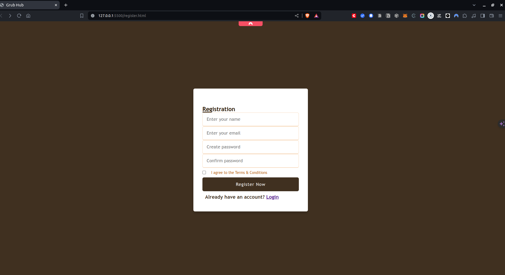
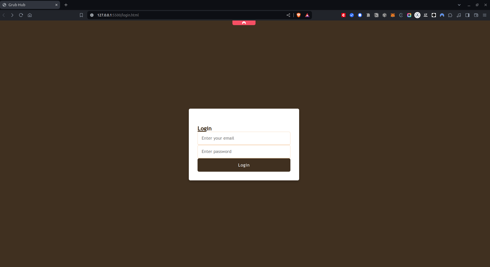
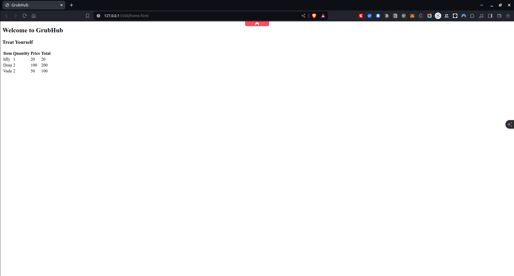
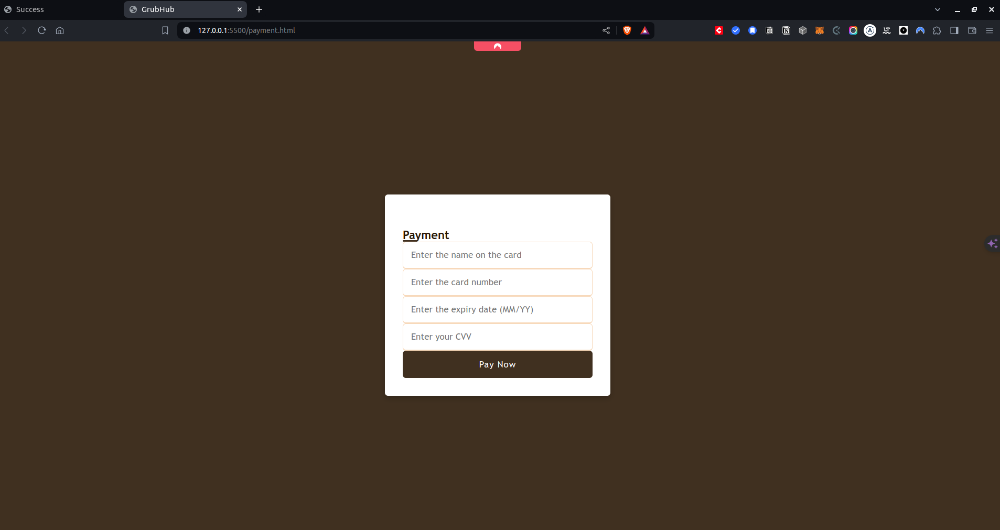
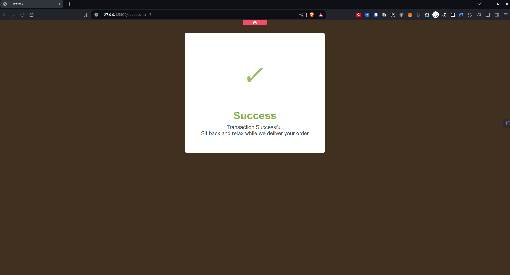

# GrubHub
## A simple food ordering application. 

### Created as part of MERN stack learning exercise.

### GrubHub is a simple food ordering app. GrubHub is built using HTML, CSS and JavaScript.

TODO: 
- [ ] Please note that the JavaScript portion.
- [ ] Beautifying the pages using [ ] Bootstrap is work in progress.
- [ ] Adding validations to Forms & Fields.
- [ ] Adding Payment validations.

### Registration

The App allows new users to register using the Registration form.

### Login

If the user has previously registered they can follow the Login page.

### Order

The Ordering page is WIP

### Payment

The payment page lets the users to pay using their card.

### Success

The success page notifies the successful payment.

